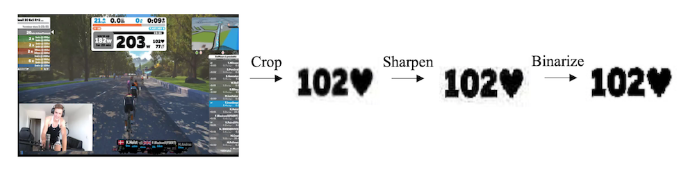

# zwift_ocr

## Project Description

The following python scripts allow one to scalably mine biometric data (e.g. Heart Rate + Power) from Zwift biking videos. Emotional facial expression analysis was extracted utilizing iMotions (Version 8.0).

Code Dependencies: Tesseract 4.1.1, ffmpeg 4.2.2

`ffmpeg.py` - Provides basic functionality including the ability to slice videos, change the frame rate, concatenate two videos together, crop the video, and, lastly, split the video into its constituent frames.

`tesseract_flow.py` - Handles image pre-processing and runs tesseract OCR (psm 7 "outputbase digits) on a directory full of frames. Before running OCR, images were cropped and subequently subject to sharpening and binarization. See `tess_data` for raw tesseract results.

`data_analysis.py` - Cleans data and removes outliers (incorrect results) from tesseract predictions. Visualizes resulting data.